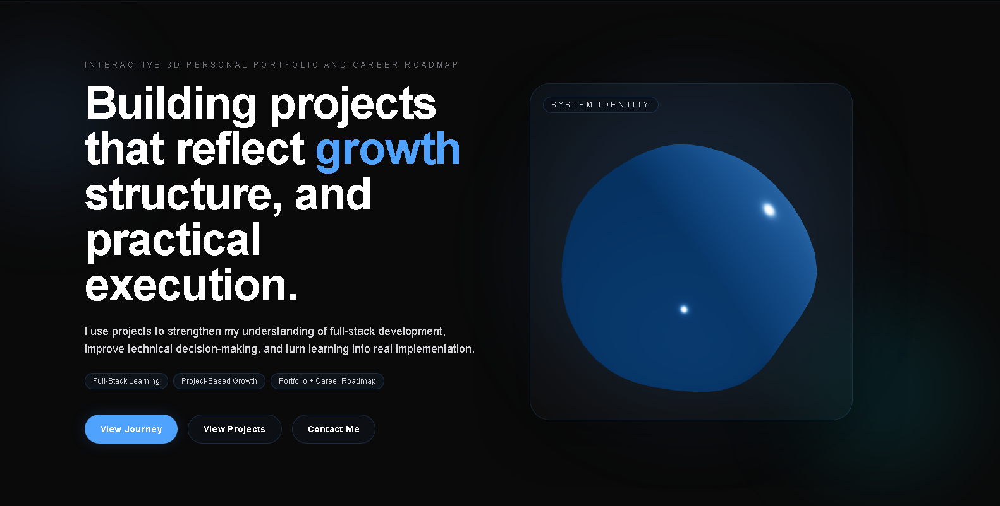
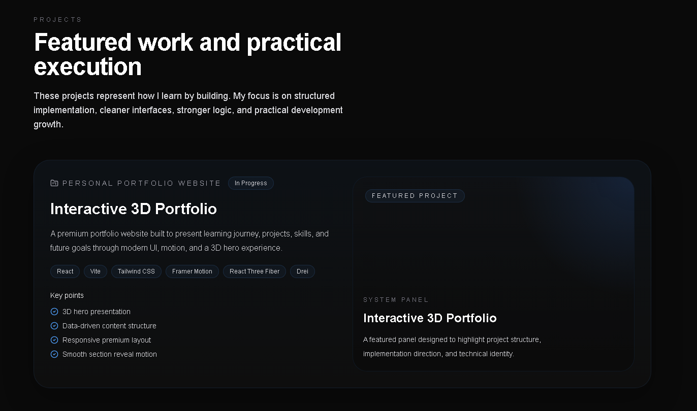
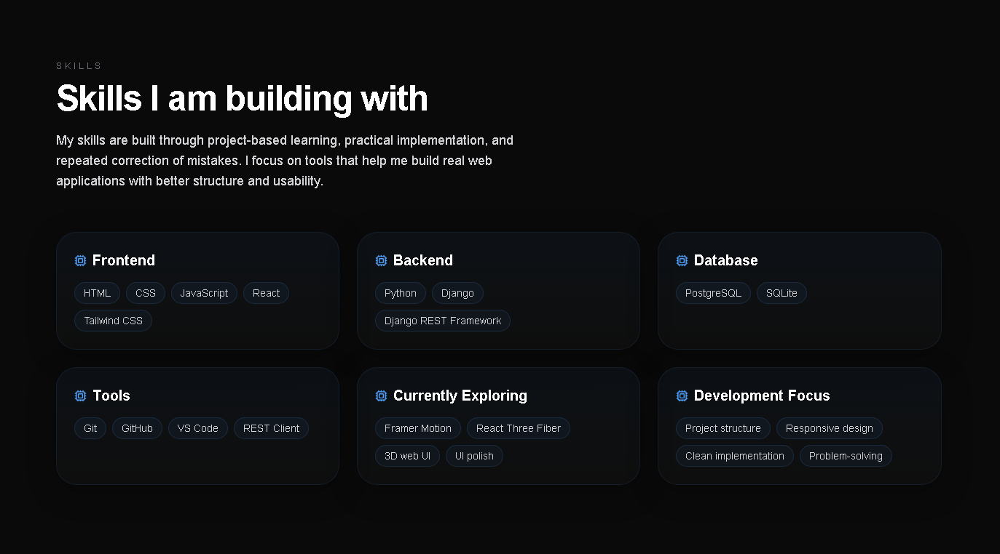
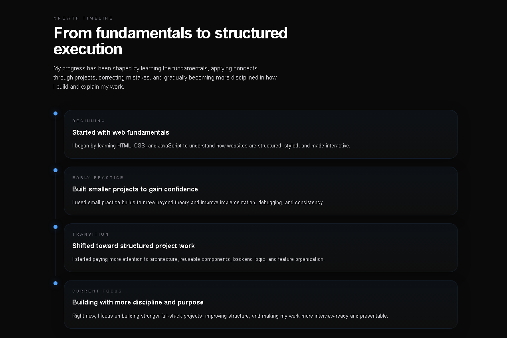

# Interactive 3D Portfolio

A modern personal portfolio website built with React, Vite, Tailwind CSS, Framer Motion, and React Three Fiber.

This portfolio is designed to present real project work, technical skills, learning progress, and future goals through a clean visual interface with motion and 3D elements.

## Purpose

The goal of this portfolio is to show practical frontend execution, project presentation ability, and clean UI structure.

It is not only a resume page. It is built to highlight real project work, especially full-stack projects like CodeGuide.

## Featured Project

### CodeGuide - Guided JavaScript Learning Platform

CodeGuide is a full-stack JavaScript learning platform MVP focused on guided beginner learning.

It includes:

- Structured JavaScript lessons
- Browser-based coding challenges
- Hint ladder support
- Mistake-based feedback
- Debugging exercises
- Progress tracking
- Final mini project submission
- Backend-controlled certificate eligibility
- QR-verifiable public certificate page

Repository:

```txt
https://github.com/Paras1310/codeguide
```

## Tech Stack

- React
- Vite
- Tailwind CSS
- Framer Motion
- React Three Fiber
- Drei
- JavaScript

## Main Sections

- Hero section with 3D visual presentation
- Identity strip
- Skills section
- Timeline section
- Projects section
- Future goals section
- Contact section

## Screenshots

### Hero Section



### Projects Section



### Skills Section



### Timeline Section



## Local Setup

Clone the repository:

```bash
git clone https://github.com/Paras1310/interactive-3d-portfolio.git
cd interactive-3d-portfolio
```

Install dependencies:

```bash
npm install
```

Run the development server:

```bash
npm run dev
```

Open:

```txt
http://localhost:5173
```

Build for production:

```bash
npm run build
```

## Project Structure

```txt
interactive-3d-portfolio/
├── public/
├── screenshots/
├── src/
│   ├── components/
│   ├── data/
│   ├── pages/
│   ├── sections/
│   ├── App.jsx
│   ├── index.css
│   └── main.jsx
├── package.json
├── vite.config.js
└── README.md
```

## Notes

This portfolio currently includes source code only.

A live demo link should be added only after deployment.

## Current Status

```txt
Portfolio MVP complete
CodeGuide project added
GitHub repository published
Ready for deployment
```